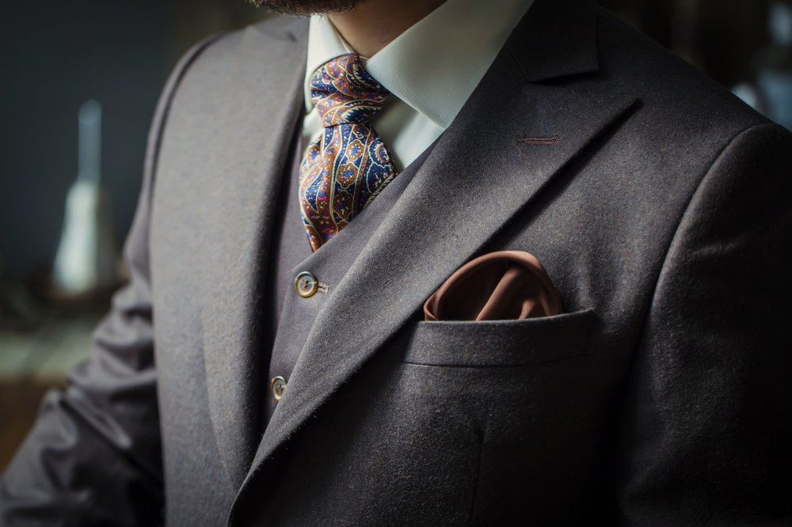
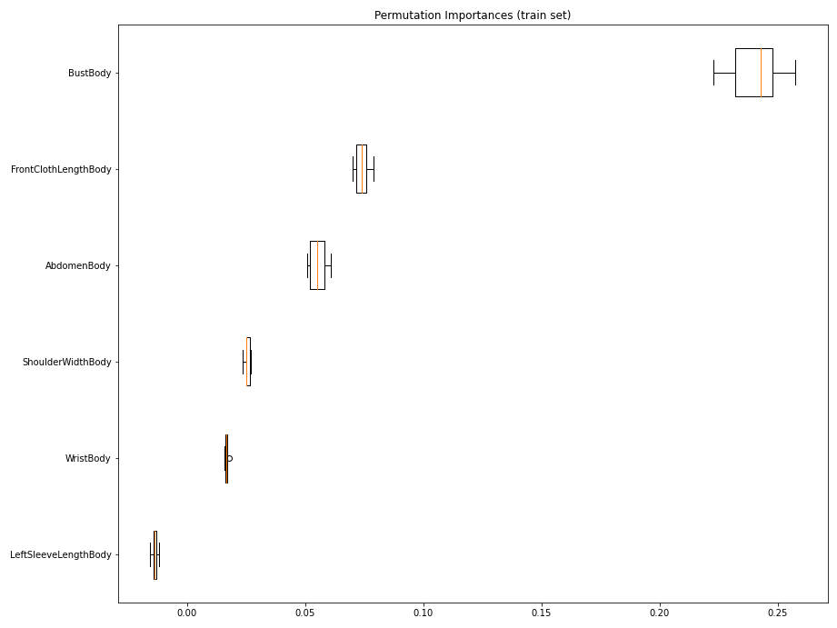
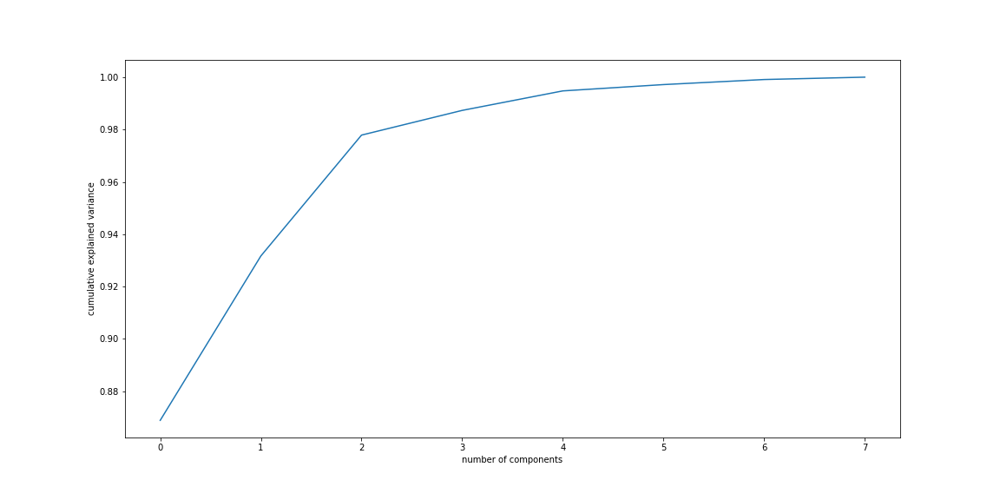

# TruTailorCo TruFit



Perfect fit, guaranteed, every time

---

## Data Acquisition
Points of measurements:
- Jacket:
    - Front length
    - Back length
    - Shoulder
    - Chest
    - Front Chest
    - Stomach
    - Bicep
- Pants:
    - Waist
    - Hip
    - Thigh
    - Knee
    - Calf
    - Cuff
    - Crotch

---

## EDA

Data was recieved in a fairly cleaned and organized state. Rows with zeroes were removed, as they represented orders without a jacket order.

Because we are working with body measurements, multicollinearity was a concern, due to the geometric nature of the human body. I had initially began by removing features and targets by intuition and followed with a permutation importance plot on the targets.  


Principal component analysis was another method I'd considered to reduce the effect of collinearity. The cumulative explained variance plotted against the number of components to be used can be seen below.  


Ultimately, PCA was not used. Further exploration is required.

---

## Modeling

I decided to utilize a random forest regression for the following reasons:  
- natively supports multi-outputs
- reduce overfitting of data commonly associated with a single decision tree
- valuation of accuracy of results over interpretability

I considered the use of a neural network, but because of the constraint of a limited dataset as well as the operating expense of a neural network, I ultimately went with the simplicity of a regression model.

A random, cross-validated search on a random forest regresson was used to tune and fit the model. Further tuning is required.

Two methods were used to train the model. The first method takes three features to predict on nine targets. The second utilizes two model. The first predicts a full set of body measurements, which is then used to predict the final garment measurements. While both methods yielded similar results, the second was used in the application as it resulted in a sightly higher accuracy and lower standard error.

---

## Application

Model was pickled and built into a basic python application.

Source code for model training as well as a basic application is included in the ```src``` folder.

```predict.py``` will generate nine garment measurments for the construction of a jacket given the chest, shoulder, and wrist of an individual.

Web-app development for internal use.

---

## Next steps

Ideally, height, weight and one more arbitrary measurement would be our predictors, but my current dataset is incomplete.  
Retraining with increased features as well as fine-tuning hyperparameters are required.
